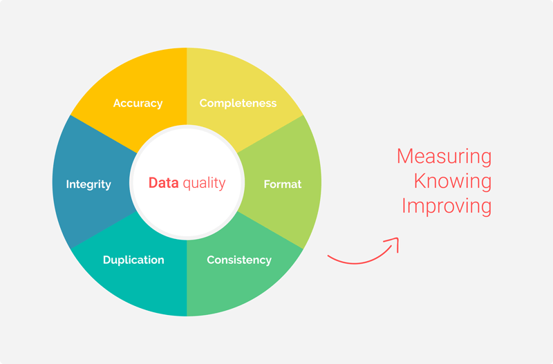

Die Datenqualität bemisst, wie gut ein Datensatz dazu brauchbar ist, einen bestimmten Zweck zu erfüllen.
In der Praxis kommen Vorgehensweisen und Werkzeuge zum Einsatz, die die Qualität von Daten analysieren oder optimieren sollen.

Häufige Beispiele für schlechte Datenqualität sind doppelt vorhandene, unvollständige, falsche oder schlecht organisierte Daten.
Auch die Datensicherheit ist hierbei ein Teilaspekt [1].

Es existieren mehrere Dimensionen von Datenqualität, die in Abhängigkeit vom Anwendungsfall eine unterschiedlich wichtige Rolle spielen:

- Genauigkeit: Die Daten bilden einen Aspekt der realen Welt hinreichend akkurat ab.
- Vollständigkeit: Der Datensatz enthält alle benötigten Informationen.
- Konsistenz: Es gibt keine Konflikte zwischen gleichen Teilen eines Datensatzes, wenn sie an unterschiedlichen Stellen gespeichert oder über das Netzwerk übertragen werden.
- Validität: Der Datensatzes weist eine durch geschäftliche Rahmenbedingungen definierte Struktur, sowie entsprechenden Inhalt auf, beispielsweise werden Formatvorgaben eingehalten.
- Eindeutigkeit: Es gibt keine Duplikate oder Werteüberschneidungen innerhalb des Datensatzes.
- Aktualität: Die Daten sind verfügbar, wenn sie gebraucht werden und aktualisieren sich in Echtzeit um korrekt und verfügbar zu bleiben.

Die sechs üblichen Dimensionen der Datenqualität [2]

Wie die Grafik veranschaulicht, werden diese sechs Dimensionen der Datenqualität zunächst zur Messung und Analyse, sowie dann auch zur Optimierung herangezogen.
